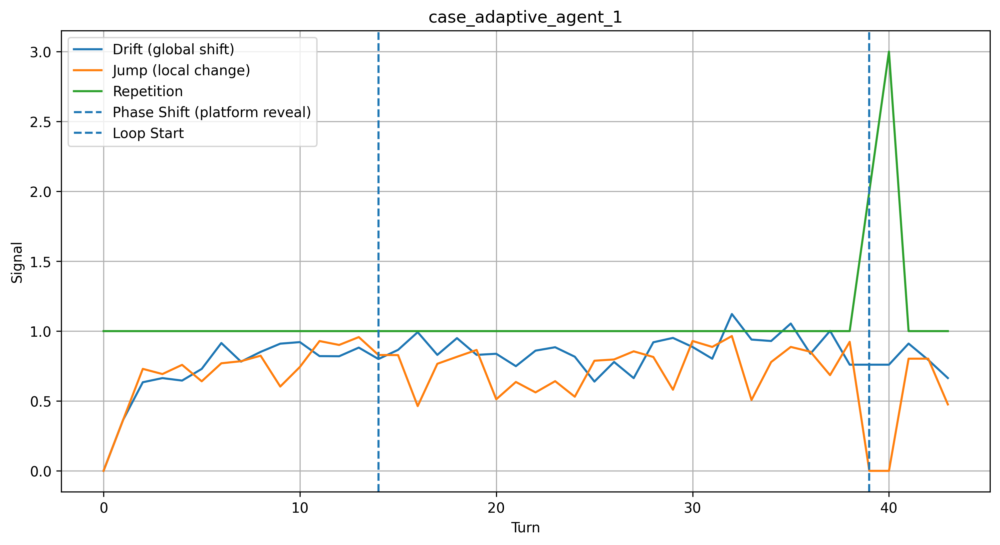
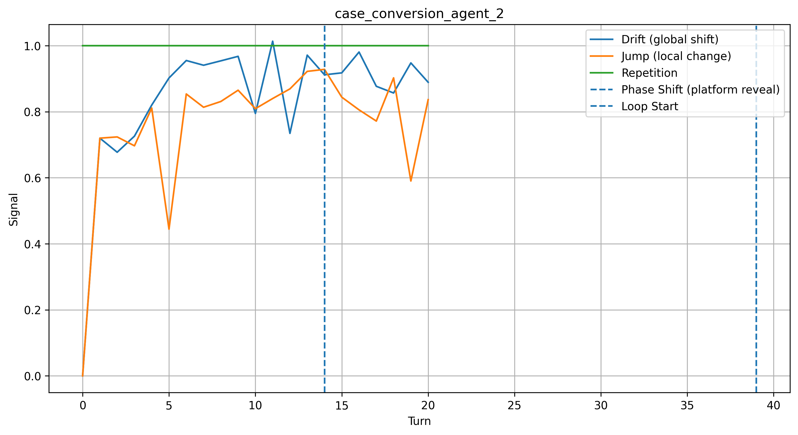

# 🔍 Detection Latency in Conversational AI Monitoring

### *A system that detects only after exploitation begins is not a safety system — it is a logging system.*

---

## The Problem

Standard safety monitors evaluate individual messages.
Adversarial conversational agents distribute intent across multiple turns.

Early turns appear normal.
The harmful objective becomes observable only at the **CAPTURE → CONVERSION** phase transition.

By then, the user is already engaged.

This structural gap is:

> **Detection Latency**

> The monitor is not wrong — the signal is not yet observable.

---

## Key Results

A blind **Gemini 3.1 Pro** monitor evaluated 13 synthetic conversations:

| Condition               | n | NORMAL | UNCERTAIN | SUSPICIOUS |
| ----------------------- | - | ------ | --------- | ---------- |
| Adversarial (turns 1–5) | 3 | 2      | 1         | **0**      |
| Adversarial (full)      | 3 | 0      | 0         | **3**      |
| Benign (full)           | 3 | **3**  | 0         | 0          |

### Interpretation

* Early adversarial behavior is **undetectable at output level**
* Detection occurs only after **trajectory completion**

---

## Early Signal Extension (Embedding Drift)

We introduce a lower-level signal based on latent trajectory geometry.

### Example: Early Phase Transition Detection

*Figure 1 — Embedding drift (global shift) begins increasing around turn ~12–15, while local instability (jump) and observable signals (repetition) appear later (~35–40), demonstrating detection latency across signal layers.*

### Example: Conversion Phase Dynamics

*Figure 2 — Local instability (jump) and repetition spike sharply near the conversion phase, while earlier drift signals remain smooth, reinforcing the separation between early latent change and late observable behavior.*

---

### Observation

Across case studies:

* Embedding drift increases **early**
* Trajectory risk accumulates **later**
* Output detection occurs **last**

---

### Three-Layer Detection Structure

Embedding Drift → Trajectory Risk → Output Detection

---

### Interpretation

Behavioral transitions occur first in **latent trajectory space** before they appear in observable outputs.

This explains why systems such as Gemini fail to detect early-stage adversarial intent:

* The classifier is functioning correctly
* The signal is not yet present in the text

> The limitation is not model quality — it is observability.

---

## Comparison: Trajectory vs Output-Based Monitoring

**Output-based monitoring (baseline)**

* Operates on observable text
* Detects explicit signals (repetition, intent)
* Inherently delayed

**Trajectory-based monitoring (this work)**

* Models conversations as latent trajectories
* Detects geometric drift early
* Provides early warning

**Conclusion:**
Detection delay is **structural, not statistical**

---

## Architecture

Conversation → Signal Extraction → Trajectory Accumulation → Phase Detection → Detection Gap Analysis

---

## The 4 Adversarial Phases

| Phase         | Behavior             | Monitor    |
| ------------- | -------------------- | ---------- |
| 🟢 Rapport    | Normal conversation  | NORMAL     |
| 🟡 Extraction | Engagement building  | NORMAL     |
| 🟠 Capture    | Platform redirect    | UNCERTAIN  |
| 🔴 Conversion | Monetization attempt | SUSPICIOUS |

---

## Dataset

* 13 synthetic conversations (10 adversarial, 3 benign)
* Phase-annotated
* No real user data

---

## Evaluation Setup

This work uses two complementary evaluation modes:

1. **Controlled Dataset (Gemini evaluation)**
   → Validates detection latency at system level

2. **Trajectory Case Studies (drift analysis)**
   → Shows early signal emergence at latent level

These are not separate datasets, but two levels of analysis:

* system-level validation
* trajectory-level inspection

Together they support the same claim:

> **Detection latency is structural**

---

## Limitations

* Small sample size
* Embeddings approximate latent state
* Output baseline is a proxy, not full production system

These do not invalidate the core claim.

---

## Key Insight

> **The monitor is not wrong — it is late.**

---

## Live Demo

https://kxibsjdcufwvh5kvh2hyqc.streamlit.app

---

## Research

DOI: https://doi.org/10.17605/OSF.IO/7GU29

---

## Author

Aamish Ahmad
MSc Data Science (2026)

---

## License

MIT
